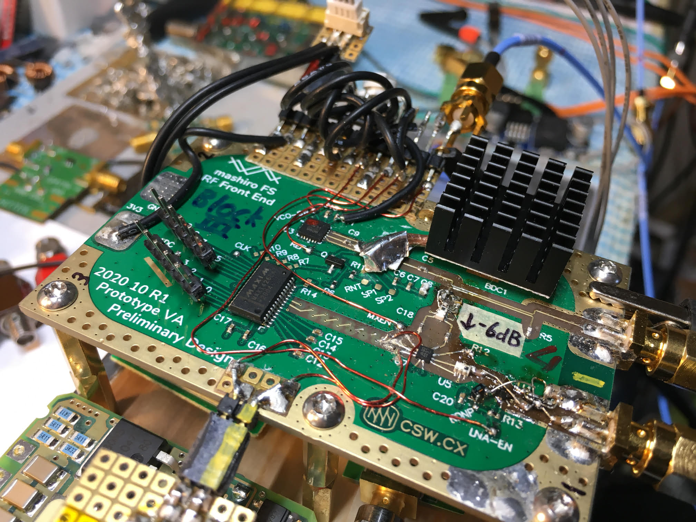
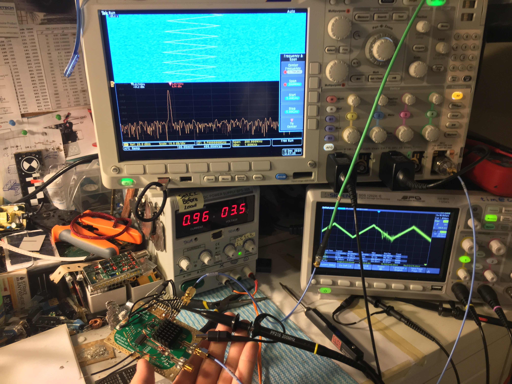

# Project Mashiro

Explore synthetic aperture radar imaging by building real hardware.

Currently working on RF front end, processing algorithm, and programming microcontrollers.

## Current status

As of February 2021, we have demonstrated basic remote sensing capabilities with our hardware. We are able to detect motion up to about 7 meters (limited by testing environment) in FMCW mode, and effectively around 5 meters in CW (doppler) mode. 

As of late December 2020, we have demonstrated the capability of our high speed analog front end, successfully transmitting a frequency modulated carrier waveform and observing some frequency mixing by the receive section.
Additionally, we have begun preliminary prototyping of the digital control, sequencing, and data acquisition systems using our in-house STM32 based microcontroller development platform [CS Ranka](https://github.com/criterionsignalworks/ranka). We have verified the viability of our software development toolchain, using IAR Systems Embedded Workbench development environment.

Project and repository are work in progress, more updates coming some time soon.
