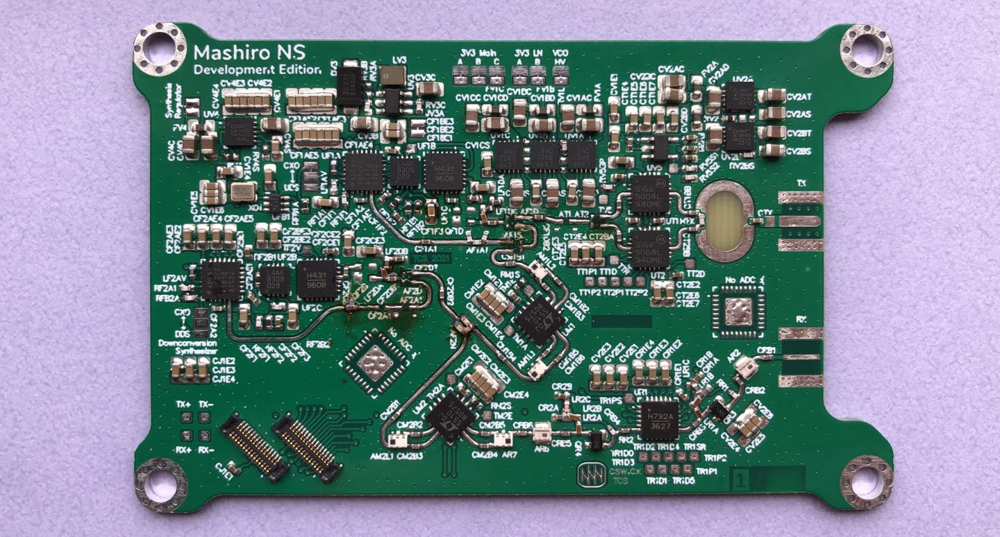
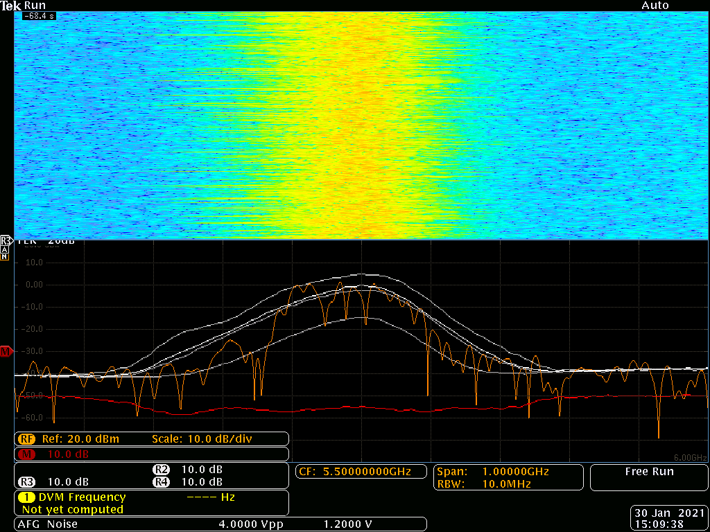

 

# Project Mashiro 

Explore synthetic aperture radar imaging by building real hardware. 

Currently working on RF front end, processing algorithm, and programming microcontrollers. 

## Abstract 

The ability for autonomous robots to understand their surroundings is instrumental for their ability to interact and navigate the environment safely and effectively. Current autonomous platforms rely heavily on LIDAR and optical camera sensors due their high resolution, compact form factor, and integration accessibility. 

In emergent applications for robotics like search and rescue as well as situations that push the envelope within mainstream applications, harsh environmental conditions like dust, rain, fog, or snow limit the performance of contemporary optical sensor suites. 

Radar imaging uses lower frequencies with wavelengths in the millimeter to centimeter range, while optical methods utilize wavelengths in the hundreds of nanometer range. The longer wavelength of radiofrequency sensing increases dependability in certain situations at the expense of yielding inferior resolution. 

Our system operates at 5.8 GHz for improved immunity from environmental interference compared to typical 77 GHz automotive systems, as well as increased resolution from radar platforms that operate at an even lower frequency. We also apply Synthetic Aperture Radar imaging technique to enhance effective resolution by utilizing the motion of the platform to synthesize a larger virtual aperture aided by computation in hardware. 

We developed an alternative radar architecture featuring two independent synthesizers and downconverters which allow much greater flexibility and performance compared to existing systems which produce baseband at near zero frequency. Our platform is also physically compact, economical, and flexible in realization, which makes it suitable for deployment in size constrained applications and easily extended to fit specific use cases. 

 

## Current status 

As of March 2021, we have begun additional exploration and development of a processing script for data captured from analog front end. Current plans include use of range migration algorithm presented in §10 of *Spotlight Synthetic Aperture Radar* with modifications to motion correction element. Additionally, we developed [CS Gain Block](https://github.com/criterionsignalworks/gain-block) for rapid prototyping the receive section for our next hardware iteration. 

As of February 2021, we have demonstrated basic remote sensing capabilities with our hardware. We are able to detect motion up to about 7 meters (limited by testing environment) in FMCW mode, and effectively around 5 meters in CW (doppler) mode. 

As of late December 2020, we have demonstrated the capability of our high speed analog front end, successfully transmitting a frequency modulated carrier waveform and observing some frequency mixing by the receive section. Additionally, we have begun preliminary prototyping of the digital control, sequencing, and data acquisition systems using our in-house STM32 based microcontroller development platform [CS Ranka](https://github.com/criterionsignalworks/ranka). We have verified the viability of our software development toolchain, using IAR Systems Embedded Workbench development environment. 

 

Project and repository are work in progress, more updates coming some time soon. 
